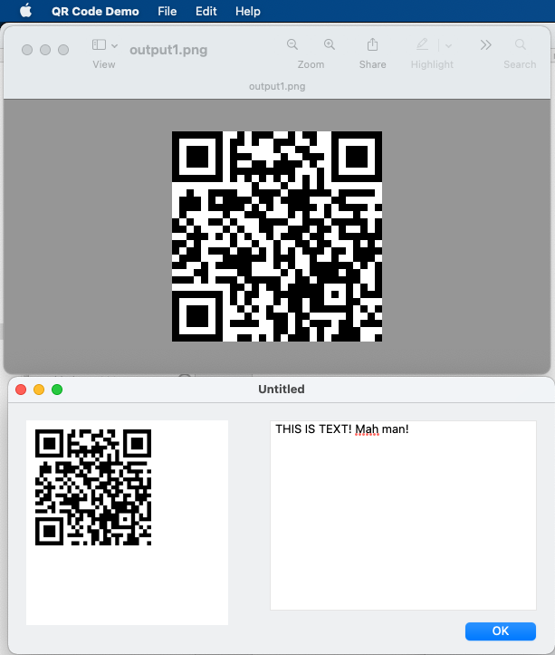

# QR_Code_Demo

An adaptation of C code found [here](https://github.com/nayuki/QR-Code-generator/tree/master/c), for Xojo and Python, working for now on Mac OS X (Intel) and Linux (Intel).

Neither language has a (free) native library for generating QR Codes, that I know of anyway, and there's plenty out there in C. So I hacked together a small dynamic library, adding PNG generation from [LodePNG](https://github.com/lvandeve/lodepng). This works well (for me anyway) on Debian and Mac OS X.

